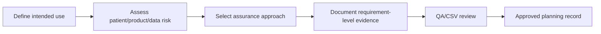
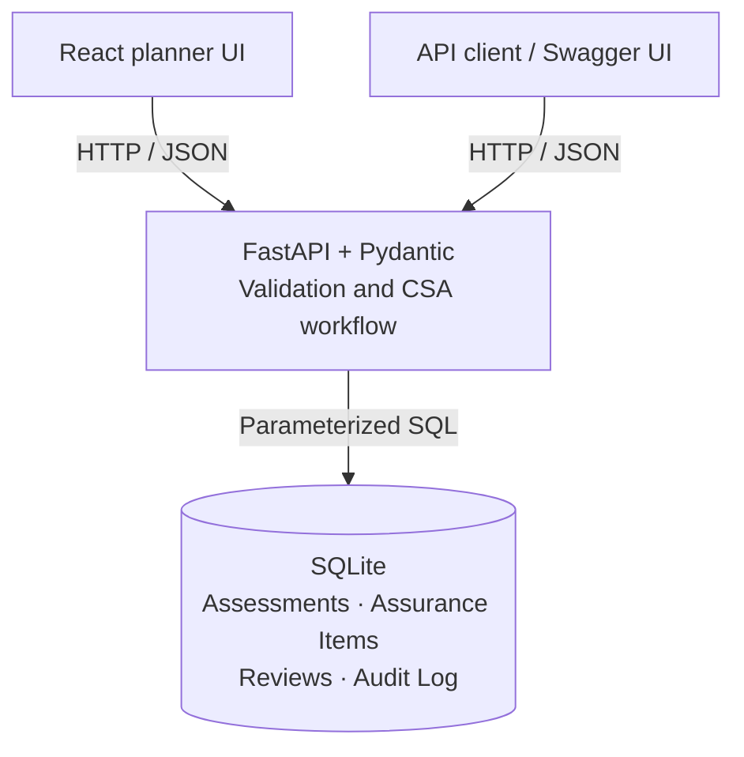

# CSA Assurance Planner

<div align="center">

[](https://github.com/alianisreyesr/csa-assurance-planner/actions/workflows/ci.yml)


**Risk-based Computer Software Assurance planning for GxP-style workflows**

*Portfolio-safe prototype · Synthetic records only · Not validated software*

</div>

---

> **Data boundary:** Every record and scenario in this repository is synthetic. Do not use it to approve releases, operate a regulated process, or claim regulatory compliance.

## What it demonstrates

CSA Assurance Planner is a FastAPI + React prototype for organizing assurance planning around intended use, risk, and evidence—not a one-size-fits-all test script. It supports:

- CSA assessments tied to a system, GAMP category, intended use, and risk level
- Requirement-level assurance items with a documented CSA classification and test strategy
- QA/CSV-style reviews with a recorded decision and comment
- An append-oriented application audit log with server-generated UTC timestamps
- Synthetic seed data suitable for a portfolio demonstration

## CSA planning flow



## Architecture



## Quick start

### Docker

```bash
git clone https://github.com/alianisreyesr/csa-assurance-planner.git
cd csa-assurance-planner
docker compose up --build
```

- API health: `http://127.0.0.1:8001/health`
- Swagger UI: `http://127.0.0.1:8001/docs`
- Planner UI: `http://127.0.0.1:8080`

### Local development

```bash
python -m venv .venv
source .venv/bin/activate  # Windows: .venv\Scripts\activate
pip install -r requirements.txt
python data/seed.py
uvicorn app.main:app --reload --port 8001
```

Frontend (separate terminal):

```bash
cd frontend
npm install
npm run dev
```

- Planner UI: `http://127.0.0.1:5173` (Vite proxies `/api` to port 8001)

Run the tests:

```bash
pytest tests/ -v
```

## API surface

| Endpoint | Method | Purpose |
|---|---|---|
| `/health` | GET | API status and synthetic-data declaration |
| `/summary` | GET | Counts for assessments, high-risk records, items, and approved reviews |
| `/assessments` | GET / POST | List or create CSA assessments |
| `/assessments/{id}` | GET | Retrieve one assessment |
| `/assessments/{id}/items` | GET / POST | List or add requirement-level assurance items |
| `/assessments/{id}/reviews` | GET / POST | List or record review decisions |
| `/audit-log` | GET | Retrieve the append-oriented audit history; filter by `assessment_id` |

Write endpoints require an `X-Actor` request header so the application can record the actor in its own audit log.

## Example assessment

```json
{
  "title": "LIMS audit trail review strategy",
  "system_name": "LIMS-01",
  "gamp_category": "4",
  "intended_use": "Define a risk-based assurance approach for audit trail review.",
  "risk_level": "high",
  "created_by": "A.Reyes"
}
```

An assurance item can classify a function as `scripted`, `unscripted`, `critical_thinking`, `record`, or `signature`, and require a rationale plus test strategy. The classification is an educational planning aid, not a regulatory determination.

## Scope & production path

This project illustrates engineering and documentation patterns relevant to CSA, data integrity, and CSV. A production implementation would additionally require authenticated identities, authorization, controlled change management, electronic-signature controls where applicable, immutable or independently protected audit records, formal validation/assurance, backups, monitoring, and organizational quality governance — each a well-defined engineering problem, not a gap in this prototype’s intent.

See [docs/REGULATORY_REFERENCES.md](docs/REGULATORY_REFERENCES.md), [docs/GLOSSARY.md](docs/GLOSSARY.md), [docs/PORTFOLIO_SAFETY.md](docs/PORTFOLIO_SAFETY.md), and [docs/ROADMAP.md](docs/ROADMAP.md).

---

## Regulated Portfolio Ecosystem

| Project | Domain Focus | Status |
|---|---|---|
| **[Quality Deviation Risk Monitor](https://github.com/alianisreyesr/quality-deviation-risk-monitor)** | Deviation prioritization & explainable risk scoring | ✅ Active · 57 tests |
| **[CSV Evidence Tracker](https://github.com/alianisreyesr/csv-evidence-tracker)** | Requirements traceability, IQ/OQ/PQ test execution, audit trail | ✅ Active · 27 tests |
| **[Data Integrity Case File](https://github.com/alianisreyesr/data-integrity-case-file)** | ALCOA+ investigation, CAPA readiness, local AI triage | ✅ Active |
| **[GxP Change Control](https://github.com/alianisreyesr/gxp-change-control)** | Controlled change lifecycle & approvals | ✅ Active · 68 tests |
| **[GxP Batch Data Pipeline](https://github.com/alianisreyesr/gxp-batch-data-pipeline)** | Batch manufacturing pipeline — DuckDB · dbt · quality gates | ✅ Active |

---

## License

MIT License — see [LICENSE](LICENSE). The license permits use of the code; it does not certify fitness for regulated use.

---

<div align="center">

**Built by [Alianis Reyes-Reyes](https://www.linkedin.com/in/alianis-reyes-reyes/)**

Information Systems @ UPRM · Eli Lilly Tech@Lilly Alumni

*Assurance is proportional to risk — this prototype demonstrates exactly that principle.*

</div>
