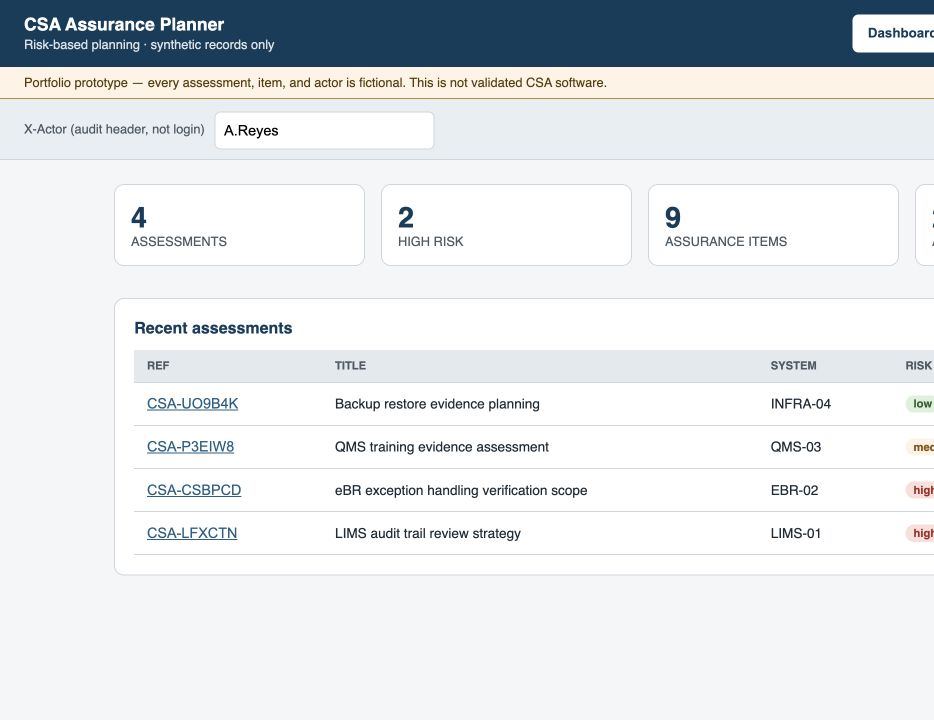

# CSA Assurance Planner

<div align="center">

[](https://github.com/alianisreyesr/csa-assurance-planner/actions/workflows/ci.yml)
[](https://github.com/alianisreyesr/csa-assurance-planner/actions/workflows/codeql.yml)
[](LICENSE)


**FDA CSA · Risk-Based Approach · GAMP 5 · Assurance Planning · GxP**

*A portfolio-safe full-stack prototype for risk-proportionate software assurance planning*

[Screenshots](#portfolio-preview) · [Quick Start](#quick-start) · [Case study](docs/CASE_STUDY.md) · [CSA Alignment](#csa-alignment) · [API Surface](#api-surface)

</div>

---

> **Data boundary:** All software systems and assurance plans are fictional/synthetic. This repository contains no proprietary, employer, patient, or regulated production data. It is **not validated software** and must not be used to make regulated quality decisions.

---

## Portfolio preview



See the [case study](docs/CASE_STUDY.md) for the business problem, users, decisions, evidence, and production boundary.

## What This Is

CSA Assurance Planner models how a quality, IT compliance, or validation engineer documents a risk-based Computer Software Assurance plan for a GxP system:

1. **Assessment intake** — Record the system, its GAMP 5 software category (1/3/4/5), intended use, and an assessor-assigned risk level
2. **Assurance items** — For each requirement, document the CSA assurance class chosen (record review, e-signature verification, critical thinking, unscripted testing, or scripted testing), with rationale and test strategy
3. **Consistency checks** — Explainable, non-blocking flags surface combinations worth a second look (e.g. a Category 5/custom system marked low risk, or a high-risk requirement relying solely on unscripted testing) — never a hard rejection, since risk determination is the assessor's judgment call, not this tool's
4. **Review** — Quality reviewers record an approve / needs-revision decision with comment
5. **Audit trail** — Every create/review action is appended to an audit log with actor, action, and UTC timestamp

This tool does not derive risk level or GAMP category for the user — those are always the assessor's documented judgment, per CSA's risk-based, critical-thinking approach. What it does do is keep that judgment visible, attributable, and flagged for a second look when a combination is unusual.

**Stack:** Python 3.11 · FastAPI · Pydantic v2 · SQLite · React 19 + TypeScript · Docker Compose · GitHub Actions

---

## CSA Alignment

The FDA 2022 CSA guidance emphasizes a risk-based, critical-thinking approach over prescriptive validation documentation. This project operationalizes those principles:

| CSA Principle | Implementation |
|---|---|
| **Risk-proportionate assurance** | `csa_class` per requirement (record / signature / critical_thinking / unscripted / scripted) documents the assurance approach chosen for that requirement's risk |
| **Intended use focus** | Every assessment requires an explicit `intended_use` statement, not just a system name |
| **Critical thinking, not a black box** | Consistency checks (`app/rules.py`) are advisory notes with a stated rationale, not a rejection gate — the assessor's judgment always stands |
| **Leveraging supplier quality** | GAMP Category 1 (infrastructure) and 3 (non-configured) are distinguished from configured (4) and custom (5) software |
| **Ongoing oversight** | Reviews and the append-only audit log support periodic reassessment |

See [docs/REGULATORY_REFERENCES.md](docs/REGULATORY_REFERENCES.md) for the underlying regulatory references and [docs/GLOSSARY.md](docs/GLOSSARY.md) for term definitions.

---

## Quick Start

### Docker Compose — recommended

```bash
git clone https://github.com/alianisreyesr/csa-assurance-planner.git
cd csa-assurance-planner
docker compose up --build
```

Then open:
- Application: `http://localhost/`
- API health: `http://localhost/health`
- API docs: `http://localhost/docs`

### Local development

```bash
# Backend
python -m venv .venv
source .venv/bin/activate
pip install -r requirements.txt
uvicorn app.main:app --reload

# Seed synthetic data (optional — the app works with an empty database too)
python data/seed.py

# Frontend (new terminal)
cd frontend
npm install
npm run dev
```

---

## API Surface

| Endpoint | Method | Purpose |
|---|---|---|
| `/health` | GET | Service state + data boundary |
| `/summary` | GET | Portfolio-level assurance metrics |
| `/assessments` | GET / POST | List (optionally `?status=`) or create an assessment |
| `/assessments/{id}` | GET | Assessment detail, including consistency notes |
| `/assessments/{id}/items` | GET / POST | List or add assurance items (requirement-level CSA class + rationale) |
| `/assessments/{id}/reviews` | GET / POST | List or record a quality review decision |
| `/audit-log` | GET | Full audit trail (optionally `?assessment_id=`) |

All `POST` endpoints require an `X-Actor` header (2–80 characters) identifying who performed the action, recorded in the audit log alongside a server-generated UTC timestamp.

---

## Data model

| Field | Values |
|---|---|
| `gamp_category` | `1` (infrastructure), `3` (non-configured/standard), `4` (configured), `5` (custom/bespoke) |
| `risk_level` | `low`, `medium`, `high` — assessor-determined, not derived by this tool |
| `csa_class` | `record`, `signature`, `critical_thinking`, `unscripted`, `scripted` |
| `decision` (review) | `approve`, `needs_revision` |

Every assessment and assurance item response includes `consistency_notes`: an array of advisory strings, empty when nothing looks unusual.

---

## Regulated Portfolio Ecosystem

| Project | Domain Focus | Status |
|---|---|---|
| **[Quality Deviation Risk Monitor](https://github.com/alianisreyesr/quality-deviation-risk-monitor)** | Deviation prioritization & explainable risk scoring | ✅ Active · 112 tests |
| **[CSV Evidence Tracker](https://github.com/alianisreyesr/csv-evidence-tracker)** | Requirements traceability, IQ/OQ/PQ test execution, audit trail | ✅ Active |
| **[GxP Change Control](https://github.com/alianisreyesr/gxp-change-control)** | Controlled change lifecycle & approvals | ✅ Active · 68 tests |
| **[Data Integrity Case File](https://github.com/alianisreyesr/data-integrity-case-file)** | ALCOA+ investigation, CAPA readiness, local AI triage | ✅ Active |
| **[GxP Batch Data Pipeline](https://github.com/alianisreyesr/gxp-batch-data-pipeline)** | Batch manufacturing pipeline — DuckDB · dbt · quality gates | ✅ Active · 12 tests |

---

<div align="center">

**Built by [Alianis Reyes-Reyes](https://www.linkedin.com/in/alianis-reyes-reyes/)**

Information Systems @ UPRM · Eli Lilly Tech@Lilly Alumni

*Assurance should be proportionate to risk - not to the thickness of the binder.*

</div>
